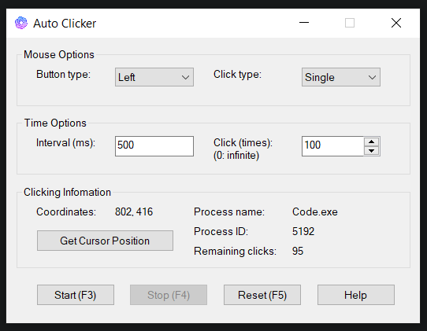

## Introduce
Auto Clicker is a compact utility tool that automates mouse clicking without taking control of your cursor. This allows you to continue performing other actions in different application windows while it runs.

## Instructions
- Select the mouse button type and click type.
- Set the interval (in millisecond) and the number of clicks (0 for infinite clicking).
- Use the 'Get cursor postion' button to display the infomation of current cursor position. Press F2 to add this to main window or press 'Esc' to return to main window.
- Click 'Start' or F3 to start auto-clicking.
- Click 'Stop' or F4 to stop auto-clicking.
- Click 'Reset' or F5 to clean all clicking settings.

## Additional features
Some features I might implement in the future:
- [ ] Macro: Record mouse actions or keystrokes instead of a single action.
  - [ ] Add context menu for right-click options.
- [ ] Add function to customize the default hotkeys.
  - [ ] Save new hotkeys to a .ini file

If you find this tool useful, please consider starring this repo! I would greatly appreciate your support. 😄